# AI-Assisted Azure IaC Vulnerability Remediation Case Study

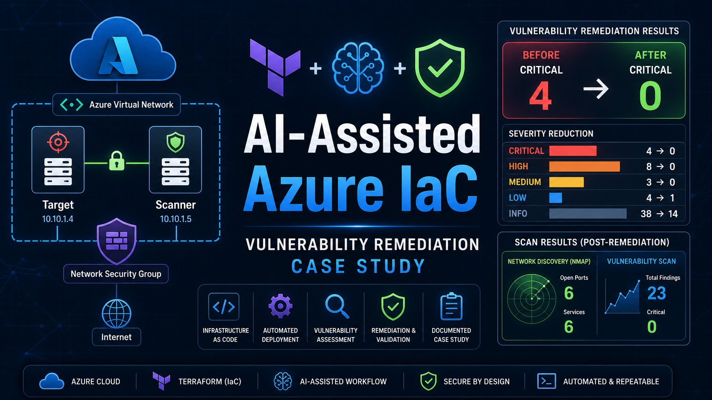

This case study documents a hands-on Azure security environment built with Terraform and guided end to end with AI-assisted engineering tools, including GitHub Copilot and Codex. It demonstrates a full enterprise-style vulnerability management lifecycle:

1. Build cloud infrastructure with Infrastructure as Code.
2. Deploy a scanner and a vulnerable target.
3. Run baseline discovery with Nmap and Nessus Essentials.
4. Introduce intentionally vulnerable services in a controlled case study scope.
5. Detect Critical vulnerabilities.
6. Simulate enterprise triage, CAB approval, and remediation ownership.
7. Remediate the affected services with scripts.
8. Validate remediation with Nmap, Nessus, and a host health check.
9. Close the work as if documenting the outcome in Jira or another enterprise case management platform.

The case study environment was intentionally kept private to the Azure virtual network for vulnerable services. Public exposure was not required to produce meaningful scanner telemetry.

## Executive Summary

This case study simulates a production vulnerability incident involving a sensitive internal security assessment server. In the scenario, the Vulnerability Management Team discovers Critical findings on a server owned by a fictional Security Assessment Team.

The issue is treated as production-sensitive and urgent. The asset owner is notified, the remediation is routed through an expedited CAB-style change request, the remediation team removes the vulnerable services, and the Security Team validates the fix with both scanner evidence and host-side checks.

Final validation confirmed that the Critical, High, and Medium findings tied to the high-severity vulnerable services were remediated.

Post-remediation Nessus result:

```text
Critical: 0
High:     0
Medium:   0
Low:      1
Info:    14
```

The remaining Low finding is unrelated to the remediated Critical services:

```text
ICMP Timestamp Request Remote Date Disclosure
```

## Visual Case Study Snapshot

The case study follows a simple enterprise pattern: build the environment, discover risk, escalate through change control, remediate, and validate.

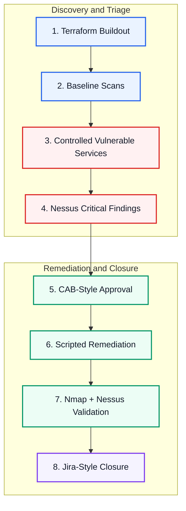

### Before and After

| Pre-Remediation | Post-Remediation |
| --- | --- |
| Critical findings present on internally exposed vulnerable services. | Critical, High, and Medium findings removed from the remediated scope. |
| 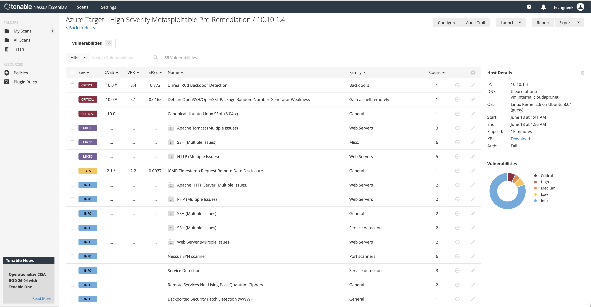 | 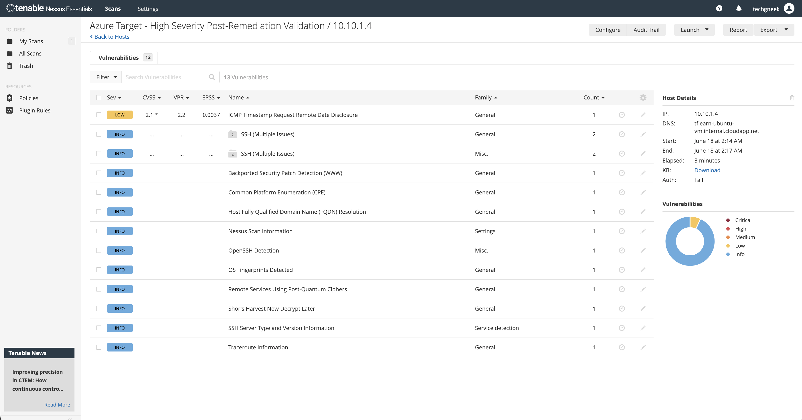 |

### Severity Reduction

| Severity | Pre-Remediation | Post-Remediation | Result |
| --- | ---: | ---: | --- |
| Critical | 4 | 0 | Remediated |
| High | 0 | 0 | No residual High findings |
| Medium | 3 | 0 | Remediated |
| Low | 4 | 1 | Residual Low tracked separately |
| Info | 38 | 14 | Informational evidence reduced |

Pre-remediation severity distribution:

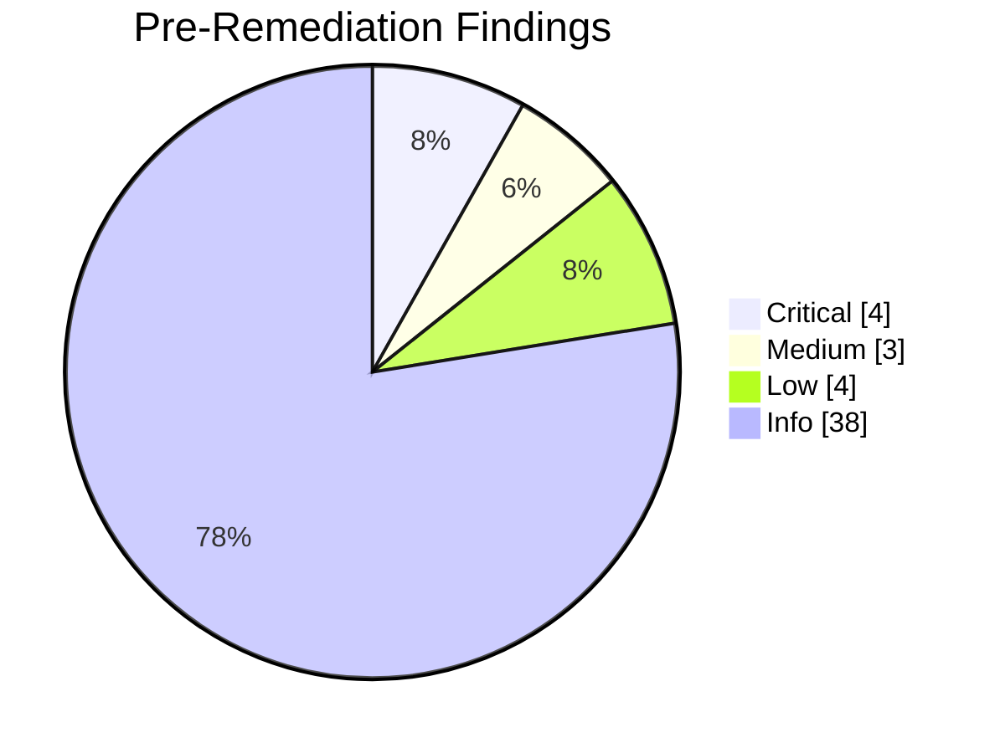

Post-remediation severity distribution:

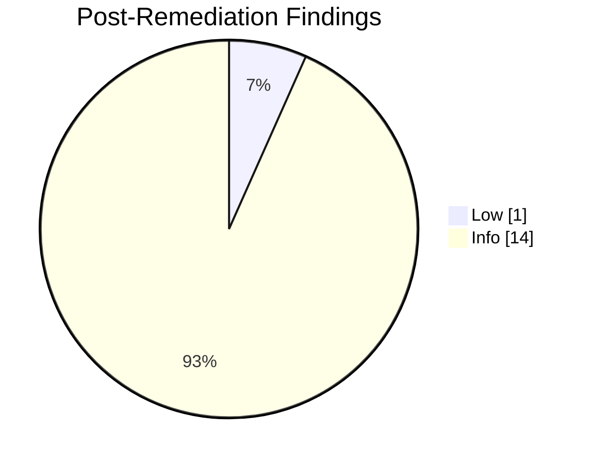

## Architecture

The case study uses two Azure Ubuntu VMs inside one virtual network:

| Role | Host | Private IP | Purpose |
| --- | --- | --- | --- |
| Target VM | `tflearn-ubuntu-vm` | `10.10.1.4` | Hosts intentionally vulnerable services |
| Scanner VM | `tflearn-nessus-scanner-vm` | `10.10.1.5` | Runs Nessus and Nmap scans |

Core Azure resources:

- Resource Group
- Virtual Network
- Subnet
- Network Security Groups
- Network Interfaces
- Public IPs
- Ubuntu target VM
- Ubuntu scanner VM

Security posture:

- SSH and Nessus UI access are restricted by NSG rules.
- Vulnerable case study services were not opened broadly to the public internet.
- Scanner-to-target testing occurred over the Azure virtual network.

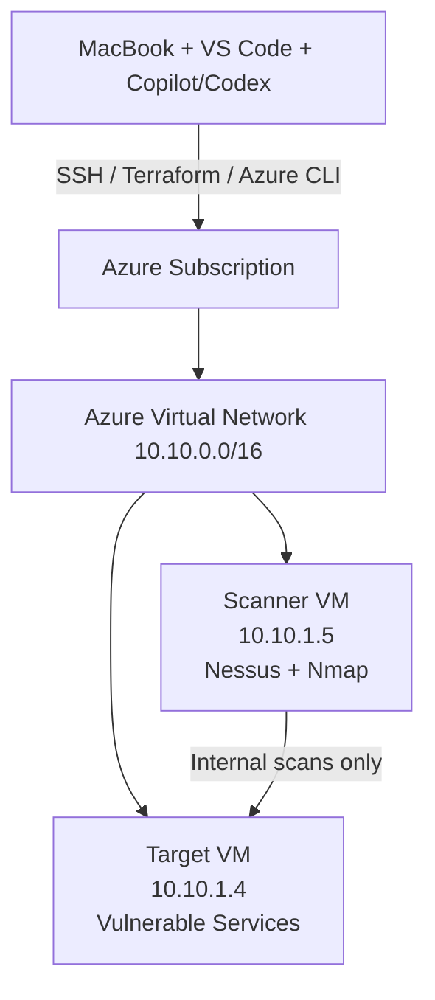

## Tooling

| Tool | Purpose |
| --- | --- |
| GitHub Copilot | AI-assisted coding and workflow support inside VS Code |
| Codex | AI agent used to build, troubleshoot, scan, document, and iterate through the case study |
| Terraform | Provision Azure infrastructure as code |
| Azure CLI | Authenticate, start, stop, and inspect Azure resources |
| VS Code | Project workspace, file editing, and Copilot/Codex interaction |
| GitHub | Intended source-control and portfolio publishing destination |
| Nessus Essentials | Vulnerability scanning and validation |
| Nmap | Service discovery and validation |
| Docker | Hosted vulnerable case study services |
| Bash | Remediation and validation scripts |
| SSH | Secure administration and tunneling between the Mac, scanner VM, and target VM |
| macOS Terminal | Local command execution and case study operations |
| Jira-style workflow | Enterprise case/change tracking simulation |
| Markdown | Portfolio documentation and evidence writeups |
| Azure Portal | Visual verification and screenshots for scan evidence |

AI was used throughout the project to accelerate the work while still keeping the technical decisions reviewable:

- Designing the Terraform case study structure
- Creating and updating Azure resources
- Installing and validating Nessus
- Building scan workflows
- Deploying intentionally vulnerable services
- Writing remediation and health-check scripts
- Interpreting Nmap and Nessus results
- Creating portfolio-ready documentation
- Organizing the work into an enterprise-style Jira/CAB/remediation storyline

Prompt tracking was also documented so the AI-assisted workflow is transparent:

- [AI prompt log](docs/ai-prompt-log.md)

Prompt previews:

| Phase | Prompt Preview |
| --- | --- |
| Terraform buildout | "Create a beginner-friendly Terraform project that deploys a small Azure security environment..." |
| Scanner setup | "Set up Nessus Essentials on a dedicated scanner VM and scan the target over the private Azure network..." |
| Vulnerable mode | "Add intentionally vulnerable services that create observable scan telemetry without broad internet exposure..." |
| Enterprise workflow | "Document the process as if this happened in a production environment with triage, CAB approval, remediation, and validation..." |
| High-severity remediation | "Generate Critical findings internally, remediate them with a script, and validate with Nmap, Nessus, and a host health check..." |

## Project Structure

```text
azure-terraform-case-study/
├── main.tf
├── variables.tf
├── outputs.tf
├── terraform.tfvars              # Local only, not committed
├── scripts/
│   ├── create_baseline_scan.sh
│   ├── host-health-check-phase4-high-severity.sh
│   ├── nessus_status.sh
│   ├── remediate-phase4-high-severity.sh
│   ├── remediate-phase4-vulnerabilities.sh
│   └── scan_status.sh
├── docs/
│   └── ai-prompt-log.md
└── reports/
    ├── baseline/
    ├── phase-2-juice-shop/
    ├── phase-3-vulnerable-mode/
    ├── phase-4-remediation/
    └── phase-4-high-severity-remediation/
```

## Phase 1: Terraform Buildout

The first phase created the Azure case study environment using Terraform.

Terraform deployed:

- Resource group
- Virtual network
- Subnet
- Network security groups
- Public IPs
- Network interfaces
- Target Ubuntu VM
- Nessus scanner Ubuntu VM

Sanitized Terraform snippet:

```hcl
provider "azurerm" {
  resource_provider_registrations = "none"
  features {}
}

locals {
  common_tags = {
    Environment = "Lab"
    Owner       = "James"
    Project     = "Terraform-Learning"
  }
}

resource "azurerm_resource_group" "lab" {
  name     = var.resource_group_name
  location = var.location
  tags     = local.common_tags
}

resource "azurerm_virtual_network" "lab" {
  name                = "${var.name_prefix}-vnet"
  address_space       = [var.vnet_address_space]
  location            = azurerm_resource_group.lab.location
  resource_group_name = azurerm_resource_group.lab.name
  tags                = local.common_tags
}

resource "azurerm_network_security_group" "scanner" {
  name                = "${var.name_prefix}-scanner-nsg"
  location            = azurerm_resource_group.lab.location
  resource_group_name = azurerm_resource_group.lab.name

  security_rule {
    name                       = "Allow-Nessus-UI-From-My-IP"
    priority                   = 110
    direction                  = "Inbound"
    access                     = "Allow"
    protocol                   = "Tcp"
    source_port_range          = "*"
    destination_port_range     = "8834"
    source_address_prefix      = var.allowed_ssh_cidr
    destination_address_prefix = "*"
  }

  tags = local.common_tags
}

resource "azurerm_linux_virtual_machine" "scanner" {
  name                = "${var.name_prefix}-nessus-scanner-vm"
  location            = azurerm_resource_group.lab.location
  resource_group_name = azurerm_resource_group.lab.name
  size                = var.scanner_vm_size
  admin_username      = var.admin_username

  network_interface_ids = [
    azurerm_network_interface.scanner.id
  ]

  admin_ssh_key {
    username   = var.admin_username
    public_key = file(pathexpand(var.ssh_public_key_path))
  }

  source_image_reference {
    publisher = "Canonical"
    offer     = "ubuntu-24_04-lts"
    sku       = "server"
    version   = "latest"
  }

  tags = merge(local.common_tags, {
    Role = "Scanner"
  })
}
```

Sensitive values such as subscription ID, local public IP, SSH key material, state files, and tfvars values were excluded from the public repository.

The purpose of this phase was to show Infrastructure as Code fundamentals: repeatable infrastructure, variables, outputs, provider configuration, and cost-controlled case study design.

Key Terraform files:

- [main.tf](main.tf)
- [variables.tf](variables.tf)
- [outputs.tf](outputs.tf)

Terraform evidence:

- [Sanitized Terraform IaC evidence](docs/terraform-iac-evidence.md)


## Phase 2: Baseline Scanning and Juice Shop

OWASP Juice Shop was deployed to create a safe web application testing target.

Juice Shop ran on:

```text
10.10.1.4:3000
```

Nmap confirmed the application was reachable and identified the service. Nessus found mostly informational web findings, which was useful because it showed a realistic limitation: not every intentionally vulnerable web app will produce dramatic Nessus results without deeper DAST tooling or authenticated crawling.

Phase 2 evidence:

- [Phase 2 scan summary](reports/phase-2-juice-shop/phase-2-scan-summary.md)
- [Nmap Juice Shop summary](reports/phase-2-juice-shop/nmap/azure-juice-shop-webapp-nmap-summary.md)
- [Nessus web app scan screenshot](reports/phase-2-juice-shop/screenshots/nessus-web-application-tests-overview.png)

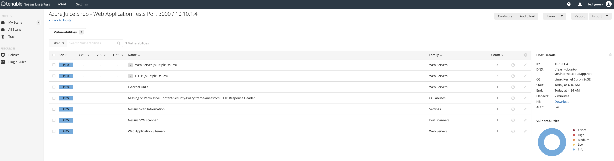

## Phase 3: Vulnerable Mode

Phase 3 added controlled vulnerable services to generate better discovery and remediation practice.

Services included:

| Port | Service | Purpose |
| --- | --- | --- |
| `2121/tcp` | Anonymous FTP | Demonstrate exposed anonymous service |
| `3000/tcp` | Juice Shop | Web app testing practice |
| `8080/tcp` | DVWA | Web app testing practice |
| `8081/tcp` | Nginx directory listing | Demonstrate exposed backup/config files |

Nmap produced strong discovery evidence:

- Anonymous FTP login allowed
- DVWA detected
- Directory listing enabled
- Backup folder exposed

Nessus found:

```text
Medium: 1
Low:    1
Info:   30
```

Phase 3 evidence:

- [Phase 3 vulnerable mode summary](reports/phase-3-vulnerable-mode/phase-3-vulnerable-mode-summary.md)
- [Nmap key findings screenshot](reports/phase-3-vulnerable-mode/screenshots/nmap-vulnerable-mode-key-findings.png)
- [Nessus vulnerable mode summary](reports/phase-3-vulnerable-mode/nessus-vulnerable-mode-summary.md)

| Nmap Key Findings | Nmap Summary |
| --- | --- |
| 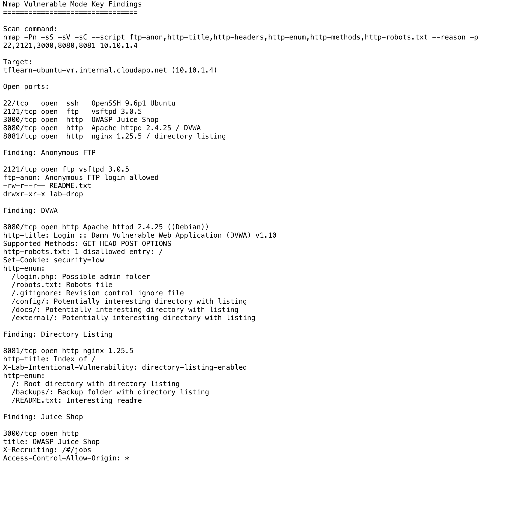 | 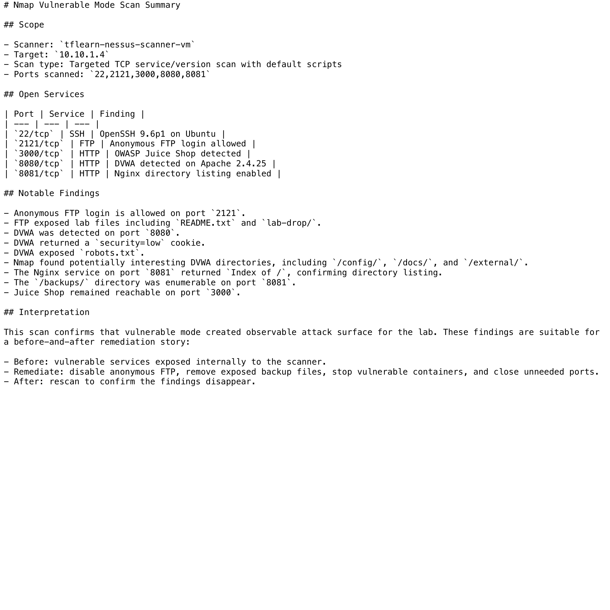 |

## Phase 4: First Remediation Practice

The first remediation phase fixed two lower-risk but realistic misconfigurations:

- Anonymous FTP on `2121/tcp`
- Directory listing on `8081/tcp`

The remediation script stopped and disabled FTP, then removed the directory-listing web container.

Script:

- [remediate-phase4-vulnerabilities.sh](scripts/remediate-phase4-vulnerabilities.sh)

Post-remediation Nmap confirmed:

```text
2121/tcp closed
8081/tcp closed
```

This phase proved the process, but the findings were not severe enough for the final portfolio story.

Evidence:

- [Enterprise remediation process](reports/phase-4-remediation/enterprise-remediation-process.md)
- [Remediation validation summary](reports/phase-4-remediation/remediation-validation-summary.md)
- [Post-remediation Nmap screenshot](reports/phase-4-remediation/screenshots/post-remediation-key-findings.png)

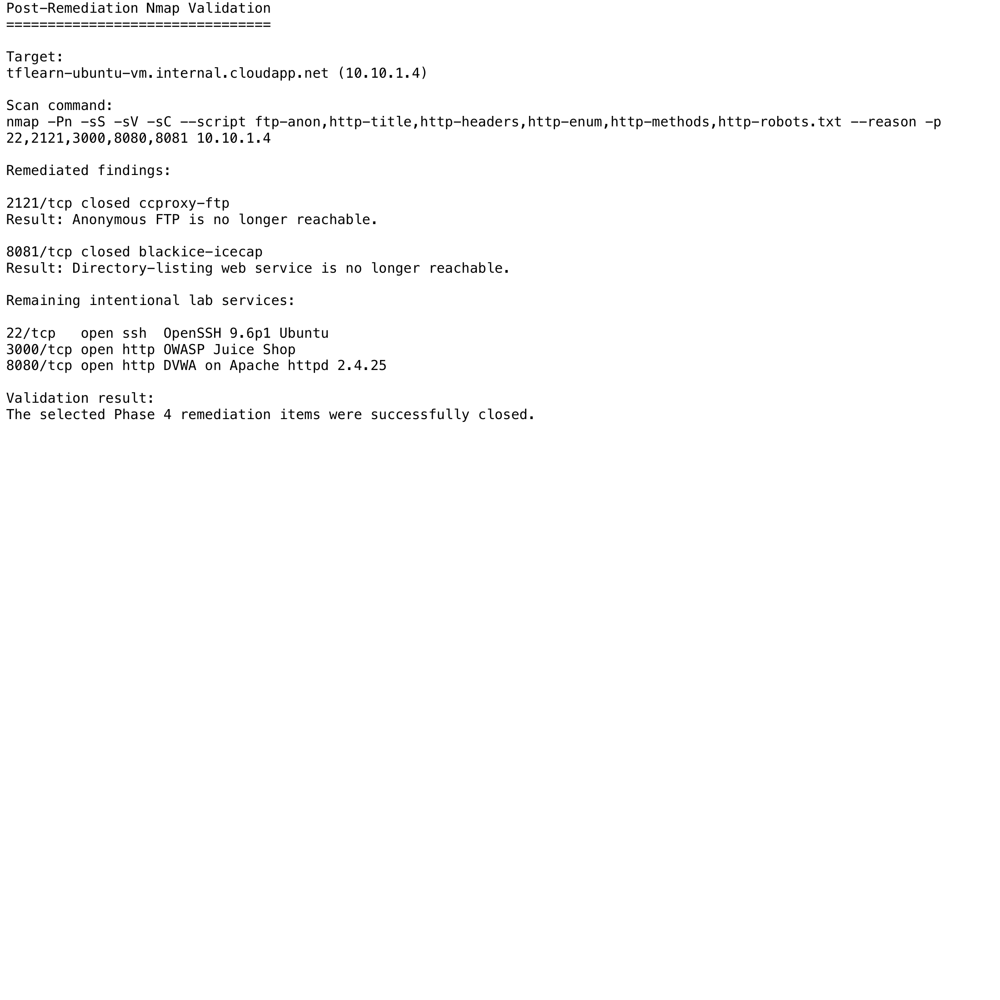

## Phase 4 Redo: High-Severity Enterprise Remediation

The Phase 4 redo became the main portfolio case study.

To produce stronger enterprise-style telemetry, internal-only vulnerable services were temporarily deployed using selected Metasploitable-style services. These services were reachable from the scanner VM over the Azure VNet, not broadly exposed to the public internet.

Pre-remediation vulnerable services:

| Port | Service | Evidence |
| --- | --- | --- |
| `8021/tcp` | FTP | `vsftpd 2.3.4` |
| `8022/tcp` | SSH | `OpenSSH 4.7p1 Debian` |
| `8023/tcp` | Telnet | `Linux telnetd` |
| `8083/tcp` | HTTP | `Apache 2.2.8` |
| `8180/tcp` | HTTP | `Apache Tomcat 5.5` |
| `8667/tcp` | IRC | `UnrealIRCd` |

Nessus detected Critical findings:

```text
Critical: 4
High:     0
Medium:   3
Low:      4
Info:    38
```

Critical findings:

- `Apache Tomcat SEoL (<= 5.5.x)`
- `Canonical Ubuntu Linux SEoL (8.04.x)`
- `Debian OpenSSH/OpenSSL Package Random Number Generator Weakness`
- `UnrealIRCd Backdoor Detection`

### Critical Finding Evidence

This is the strongest portfolio evidence from the project: Nessus identified multiple Critical findings on controlled vulnerable services before remediation.

Pre-remediation evidence:


Tomcat drilldown evidence:

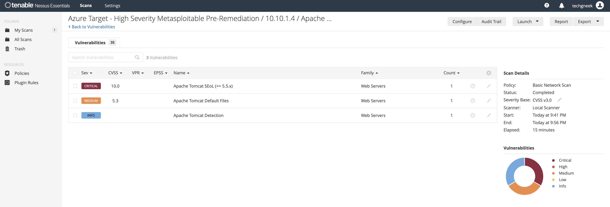

## Enterprise Workflow Simulation

This case study maps the technical work to a realistic enterprise vulnerability management process.

### 1. Detection

The Vulnerability Management Team runs authenticated or unauthenticated scanning depending on scope and available access. In this case study, Nessus and Nmap identified vulnerable services on the target host.

In the simulated enterprise scenario, the affected server is treated as a production-facing internal security assessment server.

### 2. Triage

The findings are reviewed and prioritized based on:

- Severity
- Public-facing exposure in the scenario
- Asset sensitivity
- Exploitability
- Business function
- Availability of a low-risk remediation path

The presence of Critical findings moves the case into an expedited remediation path.

### 3. Asset Owner Notification

The server owner is notified:

> Critical vulnerabilities were identified on services associated with the internal security assessment server. These services expose outdated and vulnerable software, including Tomcat 5.5, UnrealIRCd, and obsolete Linux/SSH components.

The owner confirms the vulnerable services are not required and approves removal.

### 4. Change Request

A Jira-style ticket/change request is created.

Example change title:

```text
Emergency removal of vulnerable high-risk services from internal security assessment server
```

Example change description:

```text
Nessus identified Critical vulnerabilities on internally exposed services. The asset is treated as production-facing and sensitive in this scenario. The vulnerable services are not required for business operations and should be removed immediately.
```

Implementation plan:

1. Remove the `metasploitable2-lab` container.
2. Remove the `vulnerable-apache-249` container.
3. Validate that ports `8021`, `8022`, `8023`, `8082`, `8083`, `8180`, and `8667` are closed.
4. Preserve Juice Shop and DVWA for later web application practice.
5. Save pre- and post-remediation scan evidence.

Rollback plan:

1. Recreate the vulnerable containers only if explicitly approved.
2. Re-run Nmap to confirm the services are restored.
3. Document rollback and re-open CAB review.

CAB decision:

```text
Approved for emergency remediation due to Critical vulnerability severity and low business need for the vulnerable services.
```

### 5. Remediation

The remediation team executes the approved script.

Script:

- [remediate-phase4-high-severity.sh](scripts/remediate-phase4-high-severity.sh)

Core remediation snippet:

```bash
sudo docker stop metasploitable2-lab >/dev/null 2>&1 || true
sudo docker rm metasploitable2-lab >/dev/null 2>&1 || true

sudo docker stop vulnerable-apache-249 >/dev/null 2>&1 || true
sudo docker rm vulnerable-apache-249 >/dev/null 2>&1 || true
```

This removed the high-severity case study services while leaving Juice Shop and DVWA available for future web application testing.

### 6. Security Validation

The Security Team validates remediation using three evidence sources:

1. Nmap post-remediation scan
2. Nessus post-remediation scan
3. Host health check script

Host validation script:

- [host-health-check-phase4-high-severity.sh](scripts/host-health-check-phase4-high-severity.sh)

Host health check result:

```text
PASS: Remediated vulnerable containers are not present.
PASS: Remediated high-severity ports are not listening.
HEALTH CHECK RESULT: PASS
```

Post-remediation Nmap confirmed:

```text
8021/tcp closed
8022/tcp closed
8023/tcp closed
8082/tcp closed
8083/tcp closed
8180/tcp closed
8667/tcp closed
```

Post-remediation Nessus result:

```text
Critical: 0
High:     0
Medium:   0
Low:      1
Info:    14
```

Post-remediation evidence:


### Validation Evidence Pair

| Remediation Proof | Scanner Validation |
| --- | --- |
| 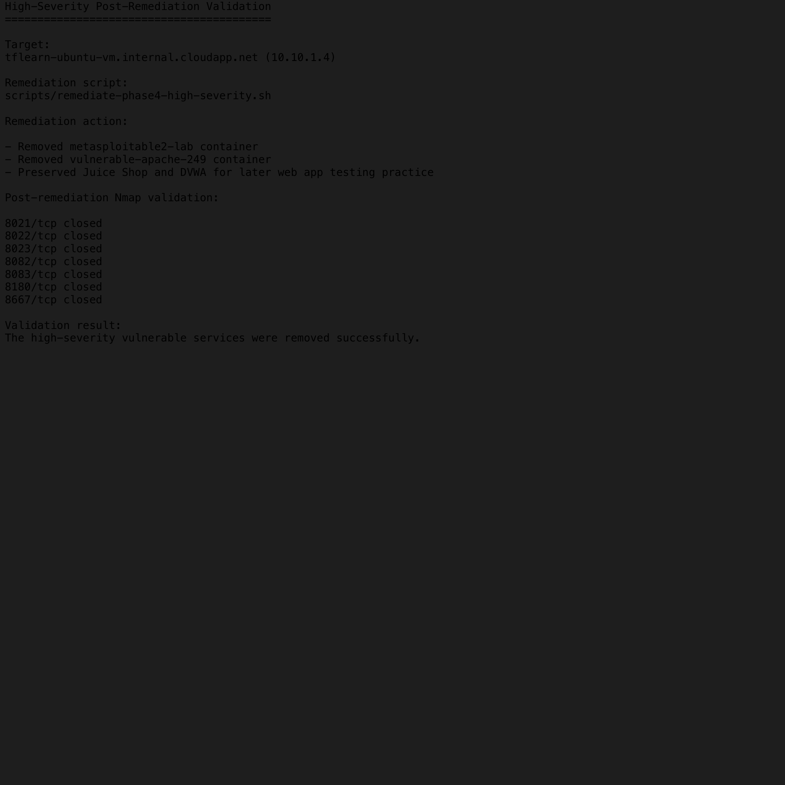 |  |

### 7. Jira-Style Closure

The case is updated with:

- Original scan evidence
- Severity counts
- Affected services
- CAB approval notes
- Remediation script
- Host health check output
- Post-remediation Nmap evidence
- Post-remediation Nessus evidence
- Residual risk note

Example ticket fields:

| Field | Value |
| --- | --- |
| Issue Type | Vulnerability Remediation |
| Priority | Emergency / Critical |
| Environment | Production scenario / Azure case study simulation |
| Affected Asset | `tflearn-ubuntu-vm` / `10.10.1.4` |
| Owning Team | Security Assessment Team |
| Detection Team | Vulnerability Management / Security |
| Remediation Team | Server Remediation Team |
| Validation Team | Security Team |
| Change Approval | CAB approved |
| Resolution | Vulnerable services removed |
| Final Status | Closed - Remediated and validated |

Closure summary:

```text
Critical vulnerable services were removed from the affected host. Post-remediation Nmap confirmed the affected ports are closed. Host health check passed. Post-remediation Nessus scan confirmed Critical, High, and Medium findings are no longer present in the remediated scope. The remaining Low ICMP timestamp finding is unrelated and may be tracked separately.
```

Status:

```text
Closed - Remediated and validated
```

## Key Evidence Links

Main Phase 4 high-severity report:

- [Phase 4 high-severity remediation summary](reports/phase-4-high-severity-remediation/phase-4-high-severity-remediation-summary.md)

Pre-remediation:

- [Nmap pre-remediation output](reports/phase-4-high-severity-remediation/nmap/metasploitable-pre-remediation/metasploitable-selected-pre-remediation.nmap)
- [Nessus pre-remediation summary](reports/phase-4-high-severity-remediation/nessus-metasploitable-pre-summary.md)
- [Nessus pre-remediation screenshot](reports/phase-4-high-severity-remediation/screenshots/nessus-high-severity-metasploitable-pre-remediation.png)
- [Tomcat critical drilldown screenshot](reports/phase-4-high-severity-remediation/screenshots/nessus-tomcat-critical-drilldown.png)

Remediation:

- [High-severity remediation script](scripts/remediate-phase4-high-severity.sh)

Validation:

- [Host health check script](scripts/host-health-check-phase4-high-severity.sh)
- [Host health check output](reports/phase-4-high-severity-remediation/host-health-check-phase4-high-severity.txt)
- [Nmap post-remediation output](reports/phase-4-high-severity-remediation/nmap/post-remediation/high-severity-post-remediation.nmap)
- [Nessus post-remediation summary](reports/phase-4-high-severity-remediation/nessus-high-severity-post-summary.md)
- [Nessus post-remediation screenshot](reports/phase-4-high-severity-remediation/screenshots/nessus-high-severity-post-remediation-validation.png)

## What This Demonstrates

This project demonstrates practical skills across multiple areas:

- Azure infrastructure design
- Terraform Infrastructure as Code
- Cost-aware cloud case study deployment
- Linux administration
- Docker-based vulnerable service deployment
- Nmap discovery and validation
- Nessus vulnerability scanning
- Vulnerability triage
- Enterprise change management workflow
- CAB-style approval process
- Remediation scripting
- Security validation
- Evidence collection
- Portfolio-ready technical documentation

## Cost Control and FinOps Lesson

Security work in the cloud has a cost impact. This case study intentionally included cost tracking because enterprise security teams are often responsible for building temporary test environments, scanners, sandboxes, and investigation workstations. Those resources need the same operational discipline as production systems.

Azure Cost Management showed the following posted Month-to-Date actual cost for the resource group as of June 18, 2026. Billing data can lag, so final numbers may change slightly after usage is rated.

| Service | Posted Cost |
| --- | ---: |
| Virtual Machines | `$1.4079` |
| Virtual Network | `$0.6388` |
| Storage | `$0.3805` |
| Bandwidth | `$0.0000` |
| **Total posted cost** | **`$2.4272`** |

Daily posted cost:

| Date | Posted Cost |
| --- | ---: |
| 2026-06-15 | `$0.1793` |
| 2026-06-16 | `$0.1712` |
| 2026-06-17 | `$0.9322` |
| 2026-06-18 | `$1.1445` |

The biggest controllable cost in this case study was VM compute. Deallocating stopped the VM compute meter while preserving the disks, NICs, public IPs, and configuration so the environment could be started again later.

This matters in an enterprise because unused cloud workstations, test servers, scanners, and temporary engineering environments can quietly accumulate spend. A good security engineer should know how to:

- Tag resources so cost can be traced to an owner, project, and environment.
- Deallocate idle VMs when active testing is finished.
- Destroy temporary environments when the work is complete.
- Review costs by resource group, service, and date.
- Communicate residual costs such as disks, public IPs, and storage.

Deallocate the VMs when not actively working:

```bash
az vm deallocate --resource-group rg-terraform-learning-lab --name tflearn-ubuntu-vm
az vm deallocate --resource-group rg-terraform-learning-lab --name tflearn-nessus-scanner-vm
```

Start them again:

```bash
az vm start --resource-group rg-terraform-learning-lab --name tflearn-ubuntu-vm
az vm start --resource-group rg-terraform-learning-lab --name tflearn-nessus-scanner-vm
```

Check status:

```bash
az vm list -d -g rg-terraform-learning-lab --query "[].{name:name,powerState:powerState,privateIps:privateIps,publicIps:publicIps}" -o table
```

Current validation after the final screenshot session:

```text
tflearn-nessus-scanner-vm  VM deallocated
tflearn-ubuntu-vm          VM deallocated
```

## Destroy the Case Study Environment

When finished, destroy the case study environment with Terraform:

```bash
terraform destroy
```

This is the cleanest way to remove the case study resources and stop ongoing Azure charges.

Destroy evidence to add after cleanup:

- Screenshot showing the resource group empty or removed.
- Confirmation that no VMs, disks, NICs, public IPs, or NSGs remain.
- Final note that ongoing Azure compute charges have stopped.

Supporting evidence page:

- [Sanitized Terraform IaC evidence](docs/terraform-iac-evidence.md)

## Next Steps

Future improvements:

- Add OWASP ZAP or Burp Suite Community for deeper web application testing.
- Add a Windows VM for credentialed Windows scanning and Defender/Sysmon telemetry.
- Add a lightweight SIEM workflow with Microsoft Sentinel.
- Convert the case study into a slide deck.
- Push the finalized project to GitHub.
