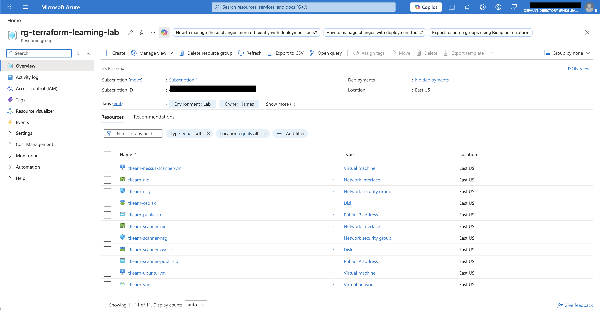
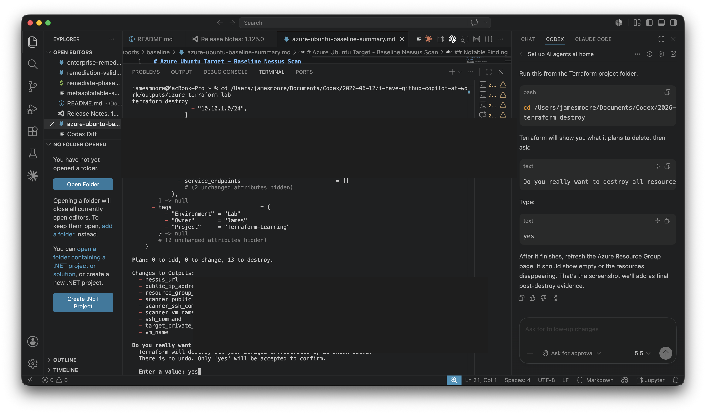
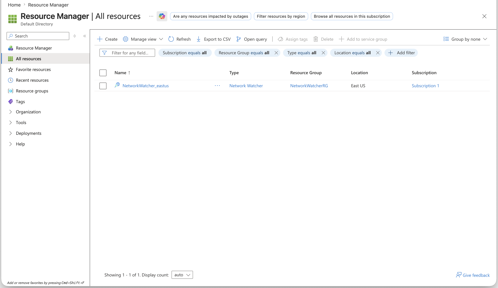

# Terraform IaC Evidence

This page documents the Terraform code used to create the Azure resources for the case study.

Sensitive values are intentionally redacted or excluded:

- Azure subscription ID
- Terraform state files
- Public IP addresses assigned by Azure
- Local workstation public IP in `allowed_ssh_cidr`
- SSH public key path details beyond the generic example
- Any local `.env` or API key material

## Azure Resource Group Evidence

The screenshot below shows the Azure Resource Group created by Terraform with the expected resources and tags.



## Sanitized Provider and Tags

```hcl
terraform {
  required_version = ">= 1.6.0"

  required_providers {
    azurerm = {
      source  = "hashicorp/azurerm"
      version = "~> 4.0"
    }
  }
}

provider "azurerm" {
  resource_provider_registrations = "none"

  features {}
}

locals {
  common_tags = {
    Environment = "Lab"
    Owner       = "James"
    Project     = "Terraform-Learning"
  }
}
```

## Sanitized Core Azure Resources

```hcl
resource "azurerm_resource_group" "lab" {
  name     = var.resource_group_name
  location = var.location

  tags = local.common_tags
}

resource "azurerm_virtual_network" "lab" {
  name                = "${var.name_prefix}-vnet"
  address_space       = [var.vnet_address_space]
  location            = azurerm_resource_group.lab.location
  resource_group_name = azurerm_resource_group.lab.name

  tags = local.common_tags
}

resource "azurerm_subnet" "lab" {
  name                 = "${var.name_prefix}-subnet"
  resource_group_name  = azurerm_resource_group.lab.name
  virtual_network_name = azurerm_virtual_network.lab.name
  address_prefixes     = [var.subnet_address_prefix]
}
```

## Sanitized Network Security Groups

```hcl
resource "azurerm_network_security_group" "lab" {
  name                = "${var.name_prefix}-nsg"
  location            = azurerm_resource_group.lab.location
  resource_group_name = azurerm_resource_group.lab.name

  security_rule {
    name                       = "Allow-SSH-From-My-IP"
    priority                   = 100
    direction                  = "Inbound"
    access                     = "Allow"
    protocol                   = "Tcp"
    source_port_range          = "*"
    destination_port_range     = "22"
    source_address_prefix      = var.allowed_ssh_cidr
    destination_address_prefix = "*"
  }

  tags = local.common_tags
}

resource "azurerm_network_security_group" "scanner" {
  name                = "${var.name_prefix}-scanner-nsg"
  location            = azurerm_resource_group.lab.location
  resource_group_name = azurerm_resource_group.lab.name

  security_rule {
    name                       = "Allow-SSH-From-My-IP"
    priority                   = 100
    direction                  = "Inbound"
    access                     = "Allow"
    protocol                   = "Tcp"
    source_port_range          = "*"
    destination_port_range     = "22"
    source_address_prefix      = var.allowed_ssh_cidr
    destination_address_prefix = "*"
  }

  security_rule {
    name                       = "Allow-Nessus-UI-From-My-IP"
    priority                   = 110
    direction                  = "Inbound"
    access                     = "Allow"
    protocol                   = "Tcp"
    source_port_range          = "*"
    destination_port_range     = "8834"
    source_address_prefix      = var.allowed_ssh_cidr
    destination_address_prefix = "*"
  }

  tags = local.common_tags
}
```

## Sanitized VM Resources

```hcl
resource "azurerm_linux_virtual_machine" "lab" {
  name                = "${var.name_prefix}-ubuntu-vm"
  location            = azurerm_resource_group.lab.location
  resource_group_name = azurerm_resource_group.lab.name
  size                = var.vm_size
  admin_username      = var.admin_username

  network_interface_ids = [
    azurerm_network_interface.lab.id
  ]

  admin_ssh_key {
    username   = var.admin_username
    public_key = file(pathexpand(var.ssh_public_key_path))
  }

  os_disk {
    name                 = "${var.name_prefix}-osdisk"
    caching              = "ReadWrite"
    storage_account_type = "Standard_LRS"
    disk_size_gb         = var.os_disk_size_gb
  }

  source_image_reference {
    publisher = "Canonical"
    offer     = "ubuntu-24_04-lts"
    sku       = "server"
    version   = "latest"
  }

  tags = local.common_tags
}

resource "azurerm_linux_virtual_machine" "scanner" {
  name                = "${var.name_prefix}-nessus-scanner-vm"
  location            = azurerm_resource_group.lab.location
  resource_group_name = azurerm_resource_group.lab.name
  size                = var.scanner_vm_size
  admin_username      = var.admin_username

  network_interface_ids = [
    azurerm_network_interface.scanner.id
  ]

  admin_ssh_key {
    username   = var.admin_username
    public_key = file(pathexpand(var.ssh_public_key_path))
  }

  os_disk {
    name                 = "${var.name_prefix}-scanner-osdisk"
    caching              = "ReadWrite"
    storage_account_type = "Standard_LRS"
    disk_size_gb         = var.os_disk_size_gb
  }

  source_image_reference {
    publisher = "Canonical"
    offer     = "ubuntu-24_04-lts"
    sku       = "server"
    version   = "latest"
  }

  tags = merge(local.common_tags, {
    Role = "Scanner"
  })
}
```

## Sanitized Variables

```hcl
variable "location" {
  description = "Azure region for all resources."
  type        = string
  default     = "eastus"
}

variable "resource_group_name" {
  description = "Name of the Azure Resource Group."
  type        = string
  default     = "rg-terraform-learning-lab"
}

variable "name_prefix" {
  description = "Prefix for Azure resource names."
  type        = string
  default     = "tflearn"
}

variable "allowed_ssh_cidr" {
  description = "Public IP CIDR allowed to SSH and Nessus UI. Use your-ip/32."
  type        = string
}
```

## Sanitized `terraform.tfvars` Example

```hcl
location            = "eastus"
resource_group_name = "rg-terraform-learning-lab"
name_prefix         = "tflearn"

# Redacted for portfolio safety.
allowed_ssh_cidr = "REDACTED_PUBLIC_IP/32"

admin_username      = "azureuser"
ssh_public_key_path = "~/.ssh/id_ed25519.pub"

vm_size          = "Standard_D2ls_v7"
scanner_vm_size  = "Standard_D2ls_v7"
os_disk_size_gb  = 30
```

## Destroy Evidence

The case study environment was destroyed with Terraform after the remediation workflow, validation scans, and documentation were completed.

Destroy command:

```bash
terraform destroy
```

Terraform confirmed the cleanup:

```text
Plan: 0 to add, 0 to change, 13 to destroy.
Destroy complete! Resources: 13 destroyed.
```

| Evidence | Screenshot |
|---|---|
| Sanitized Terraform destroy plan |  |
| Terraform destroy completion |  |
| Azure post-destroy validation |  |

Validation notes:

1. Terraform removed the case study virtual machines, public IP addresses, network interfaces, managed disks, network security groups, virtual network, subnet, and resource group.
2. Azure Resource Manager was checked after destroy to confirm the case study resources were no longer present.
3. The remaining `NetworkWatcherRG` entry shown in Azure is an Azure-managed/default networking resource and was not part of the Terraform case study infrastructure.
4. Destroying the environment stopped ongoing compute charges and reduced the chance of orphaned lab resources creating avoidable cloud spend.
