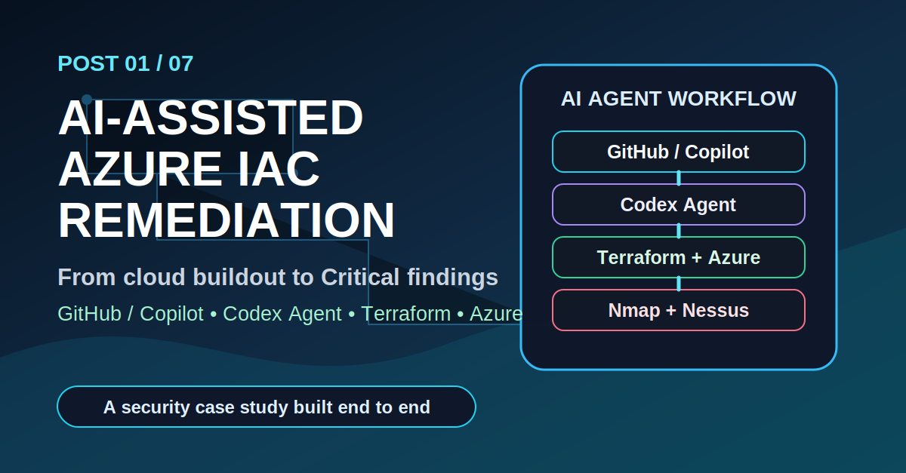
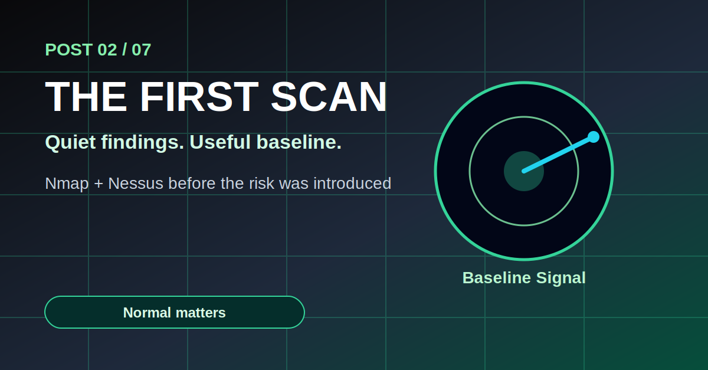
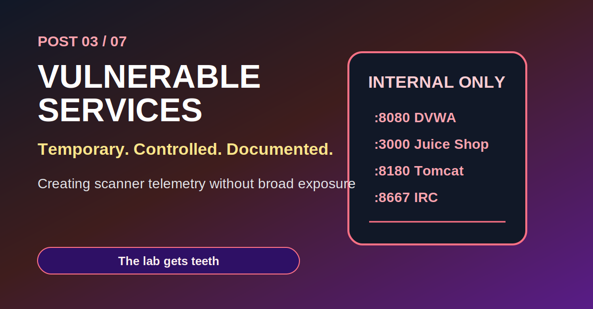
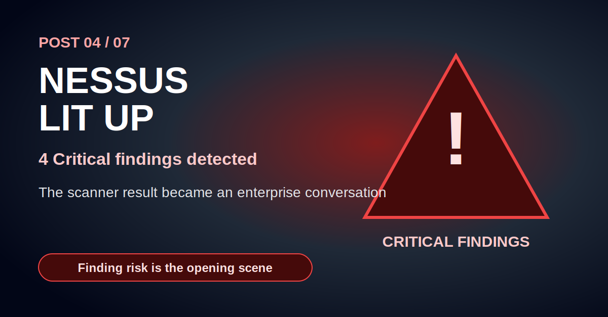
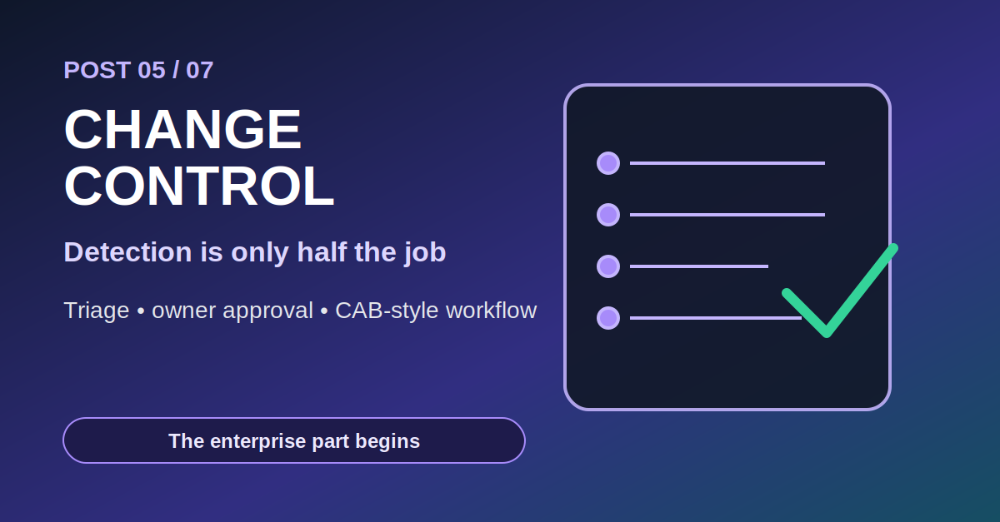
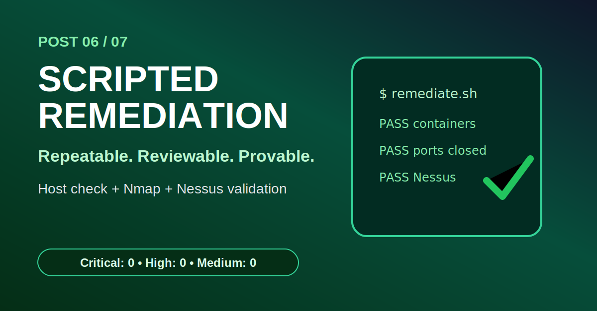
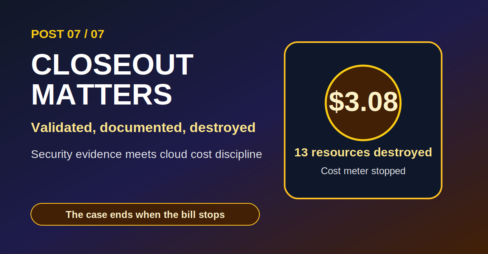

# LinkedIn Drip Campaign: AI-Assisted Azure IaC Remediation Case Study

Campaign goal:

Tell the story of the project in short, engaging posts that show cloud engineering, vulnerability management, enterprise process, AI-assisted workflow, and cost discipline.

Primary link for every post:

```text
https://github.com/techgneek/ai-assisted-azure-iac-remediation-case-study
```

## Campaign Timeline

| Day | Post | Thumbnail | Hook |
| --- | --- | --- | --- |
| Day 1 | The Build | [post-01-the-build.svg](thumbnails/post-01-the-build.svg) | I wanted to build a cyber lab that behaved like a real enterprise workflow. |
| Day 3 | The First Scan | [post-02-first-scan.svg](thumbnails/post-02-first-scan.svg) | The first scan was quiet. That was the point. |
| Day 5 | The Vulnerable Services | [post-03-vulnerable-services.svg](thumbnails/post-03-vulnerable-services.svg) | Then I gave the scanner something dangerous to find. |
| Day 7 | The Critical Findings | [post-04-critical-findings.svg](thumbnails/post-04-critical-findings.svg) | Nessus lit up with Critical findings. Now the story had teeth. |
| Day 9 | The Enterprise Workflow | [post-05-change-control.svg](thumbnails/post-05-change-control.svg) | Finding the vulnerability is only half the job. Getting it fixed is the real work. |
| Day 11 | The Remediation | [post-06-remediation.svg](thumbnails/post-06-remediation.svg) | The fix had to be repeatable, reviewable, and provable. |
| Day 13 | The Closeout | [post-07-closeout.svg](thumbnails/post-07-closeout.svg) | The case was not finished until the cost meter stopped. |

---

## Post 1: The Build

Suggested thumbnail:



Post copy:

```text
I wanted to build a cyber lab that behaved less like a toy...

and more like a small enterprise incident.

So I started with the foundation:

Infrastructure as Code.

Using Terraform, Azure, GitHub Copilot, Codex, and VS Code, I built a small cloud security environment with:

• a resource group
• a virtual network
• a target Ubuntu VM
• a scanner VM
• network security groups
• public IPs restricted for admin access

The goal was not to create a massive environment.

The goal was to create something controlled, repeatable, low-cost, and realistic enough to tell a full vulnerability management story.

Because in the real world, security work does not start with a scanner.

It starts with infrastructure.

And if the infrastructure is messy, the investigation usually becomes messy too.

This project became an AI-assisted Azure IaC remediation case study:

🧱 Terraform built the environment
🔎 Nmap and Nessus discovered risk
🛠 Scripts remediated the findings
✅ Post-scans validated the fix
💸 Azure Cost Management closed the loop

Full case study:
https://github.com/techgneek/ai-assisted-azure-iac-remediation-case-study

Next post: The first scan was quiet. That was the point.
```

---

## Post 2: The First Scan

Suggested thumbnail:



Post copy:

```text
The first scan did not find much.

And that was exactly what I wanted.

Before introducing vulnerable services, I ran baseline discovery against the Azure target VM using Nmap and Nessus Essentials.

The environment was intentionally small:

• one target VM
• one scanner VM
• private Azure networking
• restricted administrative access

The baseline gave me something important:

normal.

In vulnerability management, normal matters.

Without a baseline, every later finding floats in the dark. You do not know what changed, what was already there, or what actually came from the risky service you introduced.

The early scan mostly showed a clean, minimal attack surface.

Then I added OWASP Juice Shop.

It had a UI.
It had routes.
It had application behavior.

But Nessus still mostly produced informational findings.

That was a good lesson:

Not every vulnerable web app creates dramatic scanner telemetry with a basic scan.

Sometimes you need deeper web testing.
Sometimes you need authentication.
Sometimes you need a different tool.

And sometimes the best finding is learning what your tool does not see.

Full case study:
https://github.com/techgneek/ai-assisted-azure-iac-remediation-case-study

Next post: Then I gave the scanner something dangerous to find.
```

---

## Post 3: The Vulnerable Services

Suggested thumbnail:



Post copy:

```text
At this point, the lab needed a sharper edge.

OWASP Juice Shop was useful for web app practice, but I wanted stronger vulnerability management telemetry.

So I introduced controlled vulnerable services inside the Azure virtual network.

Not broadly exposed to the internet.
Not sitting open for the world.

Internal-only.
Temporary.
Documented.

The target began hosting services that gave Nmap and Nessus something real to identify:

• DVWA
• OWASP Juice Shop
• Metasploitable-style services
• legacy Apache/Tomcat exposure
• intentionally risky ports

This is where the case study started to feel more like an enterprise investigation.

Because now the question was not:

"Can I deploy a vulnerable app?"

The question became:

"Can I detect it, explain the risk, get approval, remediate it, and prove the fix?"

That is the difference between a lab screenshot and a security workflow.

The vulnerable services created the signal.

Now the scanner had to tell the story.

Full case study:
https://github.com/techgneek/ai-assisted-azure-iac-remediation-case-study

Next post: Nessus lit up with Critical findings.
```

---

## Post 4: The Critical Findings

Suggested thumbnail:



Post copy:

```text
Then Nessus lit up.

Not with one vague warning.

With Critical findings.

The pre-remediation scan identified issues tied to legacy and intentionally vulnerable services, including:

• Apache Tomcat SEoL
• Ubuntu Linux SEoL
• Debian OpenSSH/OpenSSL weak random number generator
• UnrealIRCd backdoor detection

That changed the tone of the project.

This was no longer just "I deployed a VM and scanned it."

Now there was a real vulnerability management problem to work through:

🔴 Critical findings existed
🧩 affected services had to be identified
📌 evidence had to be preserved
🛠 remediation had to be planned

In an enterprise, this is the moment where the scanner result becomes a conversation.

Who owns the server?
Is the service required?
Is it public-facing?
Can it be removed?
Does this need emergency change approval?

A vulnerability finding by itself is not the finish line.

It is the opening scene.

Full case study:
https://github.com/techgneek/ai-assisted-azure-iac-remediation-case-study

Next post: Finding it was easy. Getting it approved is the enterprise part.
```

---

## Post 5: The Enterprise Workflow

Suggested thumbnail:



Post copy:

```text
Finding a Critical vulnerability is only half the job.

Getting it fixed is where the enterprise work begins.

For this case study, I mapped the technical findings into a realistic workflow:

1. Detection by the Vulnerability Management Team
2. Triage based on severity and exposure
3. Asset owner notification
4. CAB-style change approval
5. Remediation by the server team
6. Validation by the Security Team
7. Jira-style closure

In a real environment, the person who finds the vulnerability is usually not the same person who remediates it.

There are owners.
There are change windows.
There are rollback plans.
There are business risks.

So I documented the project as if it were a production-sensitive internal security assessment server.

The fictional Security Assessment Team agreed the vulnerable services were not required.

The change was approved.

The remediation could move forward.

That part matters.

Because good security work is not just technical.

It is communication, documentation, and controlled execution.

Full case study:
https://github.com/techgneek/ai-assisted-azure-iac-remediation-case-study

Next post: The fix had to be repeatable, reviewable, and provable.
```

---

## Post 6: The Remediation

Suggested thumbnail:



Post copy:

```text
The remediation was intentionally simple.

That was the point.

The vulnerable services were not required, so the safest fix was removal.

No heroic workaround.
No complicated patch chain.
No "we will get to it next quarter."

The remediation script removed the high-risk containers that generated the Critical findings while preserving the training apps I still wanted for future practice.

Then came the important part:

proof.

I validated the fix three ways:

• host health check script
• Nmap post-remediation scan
• Nessus post-remediation scan

The result:

Critical: 0
High: 0
Medium: 0

The vulnerable ports were closed.
The risky containers were gone.
The scanner confirmed the findings were remediated.

This is the part I wanted recruiters and security leaders to see:

Not just that I can find issues.

That I can move them through a complete remediation lifecycle.

Full case study:
https://github.com/techgneek/ai-assisted-azure-iac-remediation-case-study

Next post: The case was not finished until the cost meter stopped.
```

---

## Post 7: The Closeout

Suggested thumbnail:



Post copy:

```text
A security case is not really closed just because the scan is clean.

It is closed when the evidence is documented...

and the environment is no longer quietly costing money.

For the final step, I documented:

• pre-remediation scan evidence
• remediation script
• host health check result
• post-remediation Nmap validation
• post-remediation Nessus validation
• Jira-style closure summary
• Terraform destroy evidence
• Azure cost lesson learned

Then I destroyed the environment with Terraform.

Final result:

Terraform destroy completed successfully.
13 Terraform-managed resources were destroyed.

The total posted Azure cost for the case study was about $3.08 after billing caught up.

That cost detail matters.

Security teams spin up scanners, sandboxes, test servers, jump boxes, and temporary investigation environments all the time.

If nobody deallocates or destroys them, the bill keeps telling the story long after the investigation is over.

My biggest takeaway:

AI-assisted engineering can move fast, but the discipline still matters.

Build clean.
Scan honestly.
Remediate with evidence.
Validate the fix.
Close the ticket.
Destroy what you no longer need.

Full case study:
https://github.com/techgneek/ai-assisted-azure-iac-remediation-case-study

Series complete: AI-Assisted Azure IaC Vulnerability Remediation Case Study.
```

